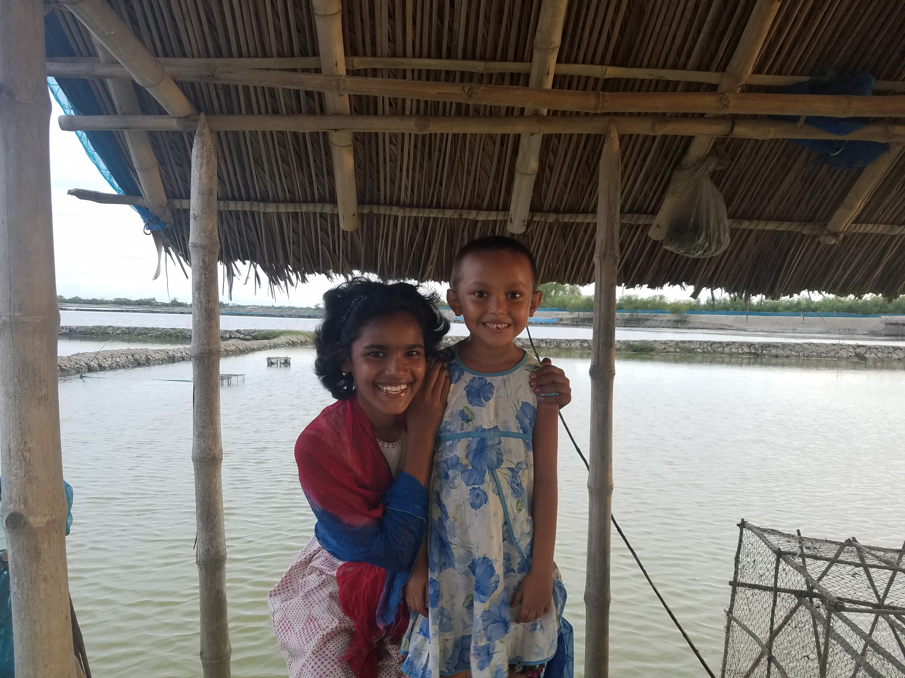

# Card Style Info Template
Created by Mrinnmoy Mondal 


## Card Style Info [Sample Page](https://mims002.github.io/websiteLayouts/cardStyleInfo/)
</img>
</img>

## How to use 
Use the given template and change fields as nessasary  
```<!-- start new org-->
<div class="container">  
  <div id="pic_set"></div>  
  <div id="description_set">  
    <!-- Organization Name-->  
    <b style="font-size: 1.2em">
      Sample Title 
    </b> <br>  
    <!-- Organization Type-->
    <div style="margin-left: 1em" ><em>
      Sample Organization Type
    </div></em>
    <p style="margin-left: 1em" >
      Sample Descrition.
    </p>
  </div>
  <!-- change button text and link-->
  <button id="get_connected_button" onclick='parent.location="https://www.google.com/"'>
    Sample Buttom Text
  </button>
</div>
<!-- end new org-->
```  
Change the Sample items in the code and provide a image path per item.


